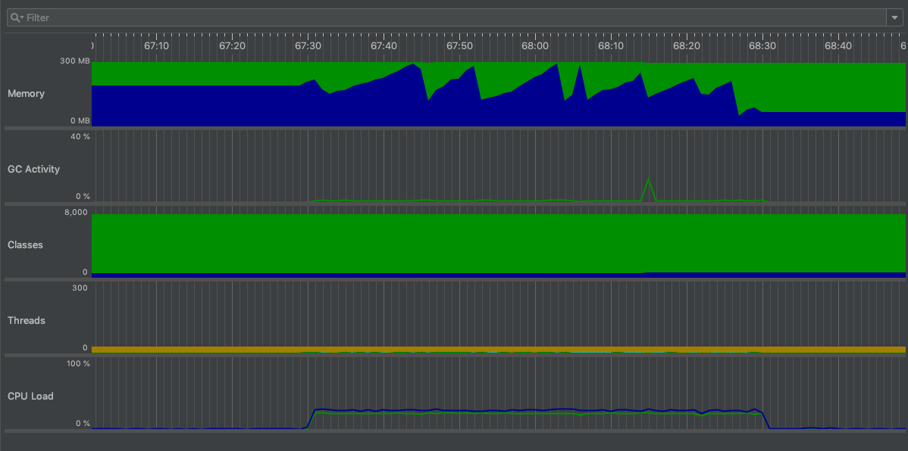
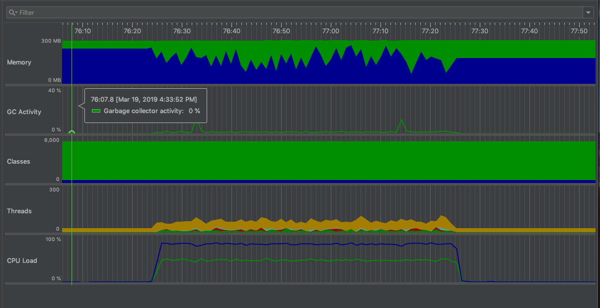
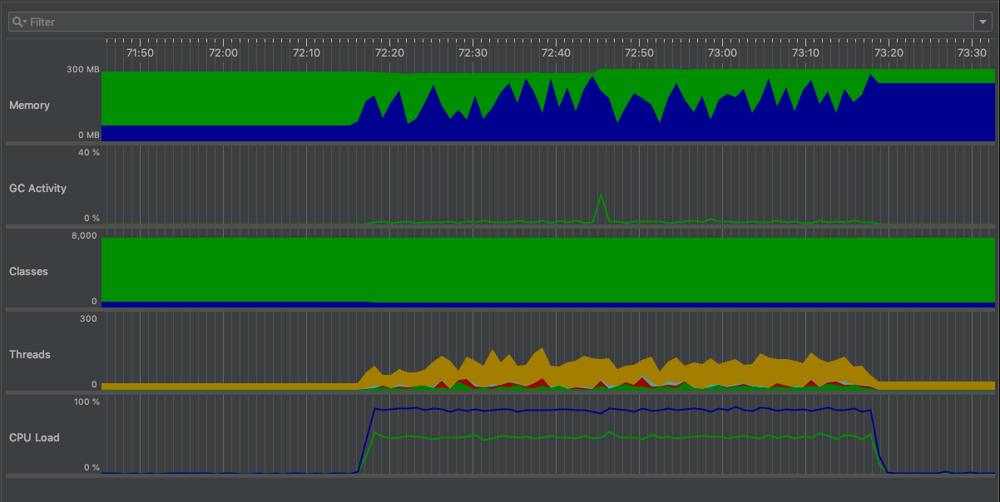
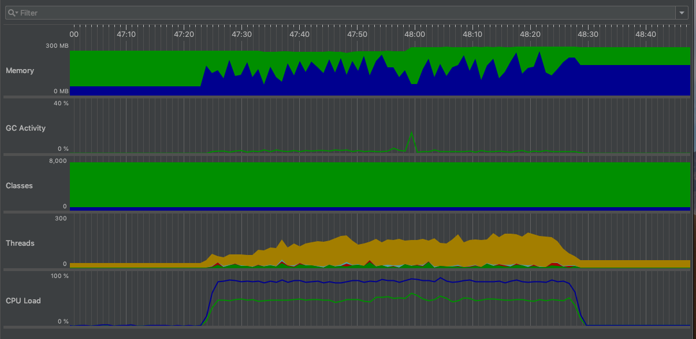
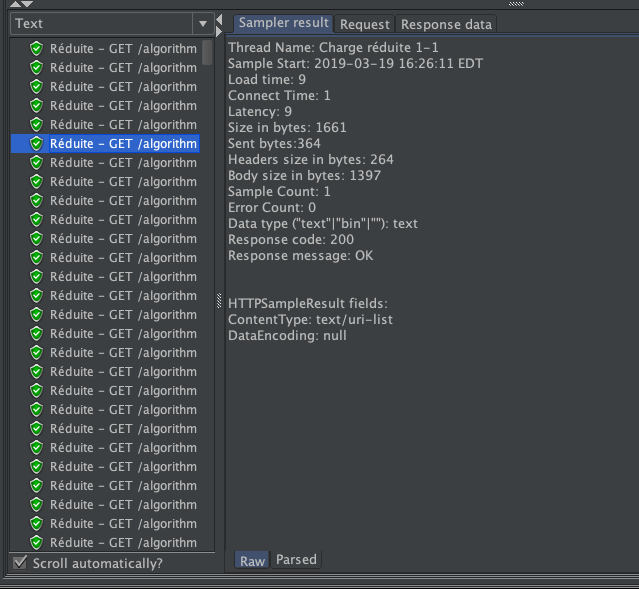
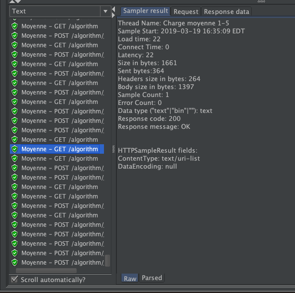
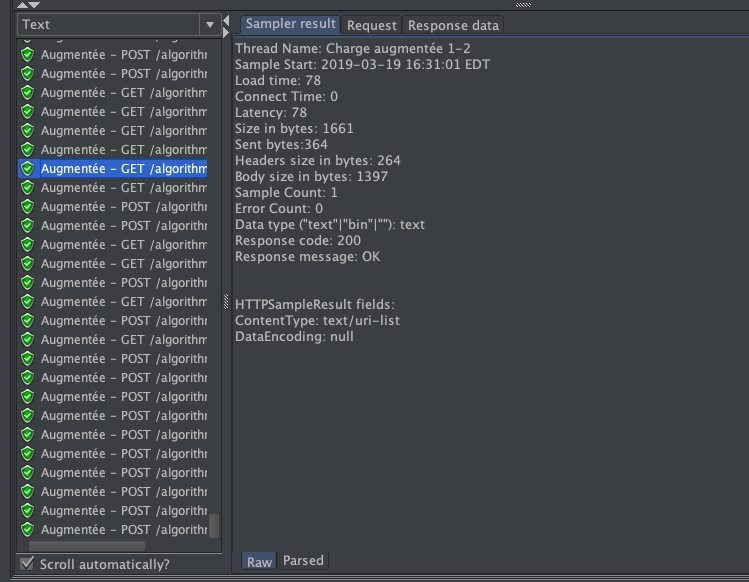
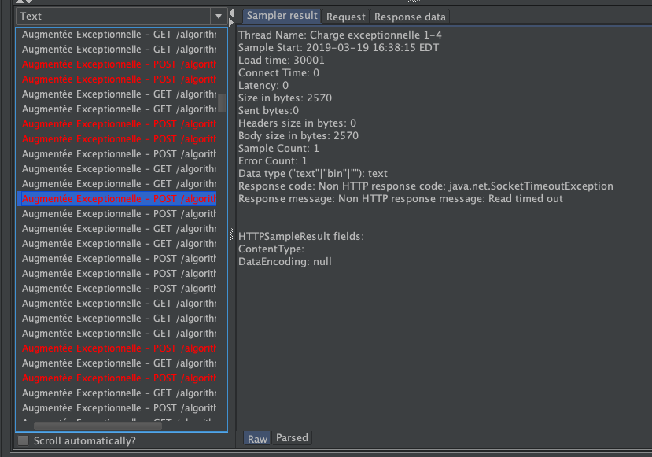

# (Q2) Manuel de déploiement de Weka en Docker

On commence par compiler le WAR avec Maven avec la commande suivante..

```mvn clean package```

On construit ensuite l'image Docker avec la commande suivante.

```docker build -t {username Docker}/jguweka:OAS3 .```

où {username Docker} est le nom d'utilisateur d'un compte Docker (ex.: `docker build -t hacene/jguweka:OAS3 .`)

On télécharge le conteneur Mongo officiel avec la commande qui suit.

```docker pull mongo```

On lance la conteneur Mongo avec la commande suivante.

```docker run --name mongodb -d mongo```

Finalement, on lance l'application Weka REST sur un conteneur avec la commande qui suit.

```docker run -p 8080:8080 --link mongodb:mongodb {username Docker}/jguweka:OAS3```

où {username Docker} est le nom d'utilisateur d'un compte Docker (ex.: `docker run -p 8080:8080 --link mongodb:mongodb hacene/jguweka:OAS3`)

On peut confirmer que le déploiement a été effectué avec succès en naviguant à l'adresse `http://0.0.0.0:8080` sur un fureteur web.

# (Q3) Manuel de configuration et d'exécution de JProfiler

Les lignes suivantes ont été ajouté au Dockerfile pour installer JProfiler:

```
# Configuration JProfiler (Q3)
RUN wget https://download-keycdn.ej-technologies.com/jprofiler/jprofiler_linux_11_0.tar.gz -P /tmp/ &&\
tar -xzf /tmp/jprofiler_linux_11_0.tar.gz -C /usr/local &&\
rm /tmp/jprofiler_linux_11_0.tar.gz
ENV JPAGENT_PATH="-agentpath:/usr/local/jprofiler11.0/bin/linux-x64/libjprofilerti.so=nowait"
EXPOSE 8849
```

Il faut ensuite rebuild le conteneur avec la commande:

`docker build --no-cache -t {username Docker}/jguweka:OAS3 .`

Notons que pour la Q3, il faut lancer l'application Weka REST sur un conteneur en mappant le port 8849 du conteneur au port 8849 de l'hôte:

```docker run -p 8080:8080 -p 8849:8849 --link mongodb:mongodb {username Docker}/jguweka:OAS3```

Il faut ensuite se connecter en SSH au conteneur avec la commande:

`docker exec -it {Container Name} bash`

où le {Container Name} peut être obtenu avec la commande `docker ps`.

Dans le conteneur, effectuer les commande suivantes pour configurer JProfiler:

```
cd /usr/local/jprofiler11.0/
bin/jpenable
```

Sélectionner l'option `1` puis appuyer sur `Enter`. Entrer le port `8849`.

Télécharger JProfiler 11.0 (même version que sur le conteneur Docker) sur l'hôte et créer une nouvelle session pointant vers l'addresse IP `127.0.0.1` en spécifiant le port 8849. La session ouverte permet ainsi l'obtention de données sur la consommation des ressources par l'application Weka REST roulant sur le conteneur Docker créé.

# (Q3) Définition des scénarios

Nous definissons 4 scénarios simulant respectivement une charge réduite, une charge moyenne, une charge augmentée et une charge augmentée exceptionnelle sur l'API de Weka REST (la configuration JMeter de chacun de ces scénarios se trouve dans le fichier `jMeter/log8371-tp2.jmx` de l'entrepôt GitHub que nous remettons).

Le **premier scénario**, celui de la charge réduite, est constitué simplement de requêtes `GET /algorithm` sur l'API de l'application Weka REST. Ce scénario met en jeu un seul utilisateur (un seul thread sur JMeter) qui lance cette requête à répétition sur l'API de Weka REST.

Le **deuxième scénario**, celui de la charge moyenne, consiste en 2 appels, un `GET /algorithm` et un `POST /algorithm/J48/adaboost` effectués en alternance à répétition par 5 utilisateurs (5 threads sur JMeter). Le fichier passé avec le `POST` est le même pour tous les appels `POST /algorithm/J48/adaboost` de ce scénario et des scénarios subséquents, les détails de ce fichier sont disponibles dans le manuel de configuration de JMeter plus bas dans ce README.

Le **troisième scénario**, celui de la charge augmentée, consiste à effectuer les 2 mêmes appels que lors de la charge moyenne, mais cette fois en utilisant 10 utilisateurs (10 threads sur JMeter).

Finalement, le **quatrième scénario**, celui d'une charge augmentée exceptionnelle, consiste à effectuer les 2 mêmes appels qu'on utilise dans les charges moyenne et augmentée, mais cette fois en utilisant 20 utilisateurs (comme pour les autres scénarios, les appels sont toujours effectués en alternance et à répétition).

# (Q3) Résultats obtenus sur JProfiler

Nous avons utilisé JMeter pour lancer les requêtes dans le cadre des scénarios que nous avons définis. La configuration de JMeter et les résultats obtenus sur JMeter se trouvent plus bas dans ce README. Cette section présente les résultats obtenus dans JProfiler lors de l'exécution des 4 scénarios définis.

### Charge réduite


Lorsqu'on exécute le scénario simulant une charge réduite sur l'API Weka REST, on voit que l'utilisation de ressources augmente (par rapport à l'utilisation de ressource en l'absence de requêtes), mais que celle-ci n'est pas considérable. On voit par exemple que l'utilisation de CPU ne dépasse pas ~20%.

### Charge moyenne


Lorsqu'on exécute le scénario simulant une charge moyenne, on voit que l'utilisation de ressources augmente beaucoup par rapport au scénario précédent. Nous attribuons ce changement au fait que ce deuxième scénario est le premier à envoyer des requêtes `POST /algorithm/J48/adaboost`. Nous estimons que les opérations sur le serveur liées à cet endpoint sont taxantes sur le système (beaucoup plus taxantes que les opérations nécessaires aux requêtes `GET /algorithm`).

### Charge augmentée


Lorsqu'on exécute le scénario simulant une charge augmentée, qui correspond aux mêmes appels que la charge moyenne, mais effectués par un nombre double d'utilisateurs (10 au lieu de 5), on voit que l'utilisation de ressources est encore une fois très élevée. Étant donné que la consommation de ressources atteignait déjà de hauts seuils lors de la charge moyenne (en raison des appels `POST /algorithm/J48/adaboost` introduits), il est difficile d'évaluer la différence entre la performance du système lors de la charge moyenne et lors de la charge augmentée avec JProfiler (JMeter se montrera plus utile).

### Charge augmentée exceptionnelle


Lorsqu'on exécute le scénario simulant une charge augmentée exceptionnelle sur l'API de Weka REST, où on passe maintenant à 20 utilisateurs qui lancent des requêtes `GET /algorithm` et `POST /algorithm/J48/adaboost`, on constante encore une fois que la consommation de ressources est très élevée. Il est ici aussi difficile de constater une différence avec le scénario précédent avec JProfiler étant donné le fait que les requêtes `POST /algorithm/J48/adaboost` sont très taxantes, JMeter se montrera plus utile à évaluer la performance du système dans ces conditions.

# (Q4) Manuel de configuration de JMeter

On commence par télécharger un binaire de JMeter à partir du site d'Apache. On lance l'application en double-cliquant sur l'exécutable `jmeter` dans le dossier `bin` du dossier extracté de l'archive obtenue.

Lorsque le GUI de JMeter s'ouvre, on clique sur le boutons `Templates...` en haut à gauche de la fenêtre, on sélectionne `Building a Web Test Plan` et on clique `Create` au bas de la fenêtre.

Un premier scénario (Thread group) est automatiquement créé. Nous le renommons simplement à `Charge réduite` pour indiquer que ce scénario correspond à celui que nous avons défini pour simuler une charge légère sur l'API de l'application Weka REST.

On commmence par définir l'addresse IP du serveur (`127.0.0.1`) et le port utilisé (`8080`) dans la fenêtre `HTTP Request Defaults`.

Ensuite, on ajoute des requêtes HTTP en faisant un clique droit sur le scénario `Charge réduite` et en sélectionnant `Add > Sampler > HTTP Request`.

Une fois la requête HTTP créée, on peut spécifier un endpoint de l'API (`Path` et `Method`) que le scénario JMeter ciblera. On peut d'ailleurs spécifier tout `header` ou `request body` nécessaire à la requête HTTP du scénario dans cette fenêtre.

Il est possible de spécifier plusieurs requêtes HTTP pour chaque scénario. Dans le cadre de ce laboratoire, étant donné l'objectif de tester l'effet de charges grandissantes sur le système, nous avons sélectionné 2 requêtes HTTP que nous effectuons sur l'API de l'application Weka REST à plusieurs reprises.

La première requête est vise l'endpoint `GET /algorithm` et la deuxième vise l'endpoint `POST /algorithm/J48/adaboost`. Lors de la requête POST, nous envoyons un fichier `.arff` que nous avons obtenu en examinant les tests présents dans le code source de Weka REST (le fichier est présent dans l'entrepot GitHub que nous remettons à l'emplacement `testData/weather.numeric.arff`).

Nous avons ainsi configuré 4 scénarios dans JMeter conformément à leur définition à la Q3, ceux-ci sont disponible dans le fichier `jMeter/log8371-tp2.jmx` de l'entrepôt GitHub que nous remettons.

# (Q4) Résultats obtenus sur JMeter

Revoyons maintenant les résultats que nous obtenons à l'aide de JMeter lors de l'exécution des 4 scénarios définis à la question 3.

### Charge réduite


Lorsqu'on exécute le scénario simulant une charge réduite, on constate que toutes les requêtes `GET /algorithm` s'effectuent avec succès (200 OK) et ce, avec une latence basse.

### Charge moyenne


Lorsqu'on exécute le scénario simulant une charge moyenne, on voit que toutes les requêtes, tant les `GET /algorithm` que les `POST /algorithm/J48/adaboost` s'effectuent avec succès. Lorsqu'on compare les `GET /algorithm` à ceux du scénario précédent, on constate une latence généralement plus élevée.

### Charge augmentée


Lorsqu'on exécute le scénario simulant une charge augmentée, on constate que, encore une fois, toutes les requêtes s'effectuent avec succès. Lorsqu'on examinait ce scénario avec JProfiler, il était difficle de constater une différence significative avec le scénario précendent. Avec JMeter, on peut voir que la latence des requêtes `GET /algorithm` est plus élevée que lors d'une charge moyenne.

### Charge augmentée exceptionnelle


Finalement, lorsqu'on exécute le scénario simulant une charge augmentée exceptionnelle sur l'API de Weka REST, on voit que plusieurs requêtes `POST /algorithm/J48/adaboost` **échouent** (*timeout*). En effet, contrairement à JProfiler qui n'indiquait pas de différence significative avec le scénario d'une charge augmentée, on voit que Weka REST n'arrive pas à traiter toutes les requêtes de ce scénario avec succès. Nous attribuons le fait que seules les requêtes `POST /algorithm/J48/adaboost` échouent étant donné qu'elles sont plus taxantes que les `GET /algorithm`.
